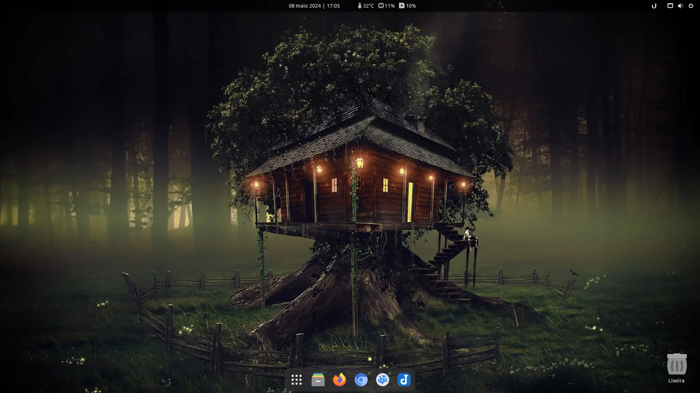

# Pos Install Scripts

<p align="center">
    
    
    
    
</p>

This script was developed with the aim of demonstrating post-installation and parameterization of my PC with **Fedora**. The aim is to build a "minimal" installation and customize it as needed, with app installations only via terminal.

> [!WARNING]\
> It is entirely free to copy and execute the scripts contained in this repository, however, you must **read and understand** what each step does. If you choose to execute it fully, knowing that my usage profile is certainly different from yours, or **adapt it (best option) to your needs** before execution modifying programs that will be installed in the repository stages, .rpm, Flatpak, Codium extensions. 
> 
> The aim in addition to demonstrating is to serve as inspiration for building **your own post-installation script**.

> [!CAUTION]\
> **Disclaimer:** The scripts made available are certainly **tested by me** before being published, however due to the nature of the difference between hardware and the period when script updates and system and package updates occur, errors may occur during execution. Therefore, **there are no full guarantees of the full functioning of this script** so **I will not be responsible if there is any material damage or loss of data**.
> 
> I **kindly** ask that in case of errors report them in the [Issues tab](https://github.com/ciro-mota/Meu-Pos-Instalacao/issues) and I will try as much as possible to help.

### 🔧 GNOME Extensions

- [AppIndicator and KStatusNotifierItem Support](https://extensions.gnome.org/extension/615/appindicator-support/)
- [Bluetooth Battery Meter](https://extensions.gnome.org/extension/6670/bluetooth-battery-meter/)
- [Date Menu Formatter](https://extensions.gnome.org/extension/4655/date-menu-formatter/) (SimpleDateFormat - String: dd MMMM y | k:mm)
- [Dash to Dock](https://extensions.gnome.org/extension/307/dash-to-dock/)
- [Desktop Icons NG (DING)](https://extensions.gnome.org/extension/2087/desktop-icons-ng-ding/)
- [Hide Activities Button](https://extensions.gnome.org/extension/744/hide-activities-button/)
- [User Themes](https://extensions.gnome.org/extension/19/user-themes/)
- [Steal my focus window](https://extensions.gnome.org/extension/6385/steal-my-focus-window/)
- [Vitals](https://extensions.gnome.org/extension/1460/vitals/)
- [Window title is back](https://extensions.gnome.org/extension/6310/window-title-is-back/)

### ⚫ Dots

There is also a folder called `confs` in which some configuration files are hosted and imported when running the script and contains my configurations for `Terminator`, `fastfetch`, `Starship` and `micro`. Other apps should be added in the future.

### 🎨 Theme

Use the [Gradience](https://flathub.org/apps/details/com.github.GradienceTeam.Gradience) app to apply the Dracula color scheme with a blue accent color instead of the default pink/purple of this theme. Import my color scheme if you want:

<details>
  <summary>Click to expand</summary>
    
```json
{
    "name": "local-theme",
    "variables": {
        "accent_color": "rgb(28, 113, 216)",
        "accent_bg_color": "rgb(26, 95, 180)",
        "accent_fg_color": "#f8f8f2",
        "destructive_color": "#f55",
        "destructive_bg_color": "#f55",
        "destructive_fg_color": "#f8f8f2",
        "success_color": "#50fa7b",
        "success_bg_color": "#50fa7b",
        "success_fg_color": "#f8f8f2",
        "warning_color": "#f1fa8c",
        "warning_bg_color": "#f1fa8c",
        "warning_fg_color": "rgba(0, 0, 0, 0.8)",
        "error_color": "#f55",
        "error_bg_color": "#f55",
        "error_fg_color": "#f8f8f2",
        "window_bg_color": "rgb(35, 37, 46)",
        "window_fg_color": "#f8f8f2",
        "view_bg_color": "rgb(35, 37, 46)",
        "view_fg_color": "#f8f8f2",
        "headerbar_bg_color": "rgb(35, 37, 46)",
        "headerbar_fg_color": "#f8f8f2",
        "headerbar_border_color": "#fff",
        "headerbar_shade_color": "rgba(0, 0, 0, 0.36)",
        "card_bg_color": "rgba(255, 255, 255, 0.08)",
        "card_fg_color": "#f8f8f2",
        "card_shade_color": "rgba(0, 0, 0, 0.36)",
        "dialog_bg_color": "rgb(35, 37, 46)",
        "dialog_fg_color": "#f8f8f2",
        "popover_bg_color": "rgb(35, 37, 46)",
        "popover_fg_color": "#f8f8f2",
        "shade_color": "#383838",
        "scrollbar_outline_color": "rgba(0, 0, 0, 0.5)"
    },
    "palette": {
        "blue_": {
            "1": "#99c1f1",
            "2": "#62a0ea",
            "3": "#3584e4",
            "4": "#1c71d8",
            "5": "#1a5fb4"
        },
        "green_": {
            "1": "#8ff0a4",
            "2": "#57e389",
            "3": "#33d17a",
            "4": "#2ec27e",
            "5": "#26a269"
        },
        "yellow_": {
            "1": "#f9f06b",
            "2": "#f8e45c",
            "3": "#f6d32d",
            "4": "#f5c211",
            "5": "#e5a50a"
        },
        "orange_": {
            "1": "#ffbe6f",
            "2": "#ffa348",
            "3": "#ff7800",
            "4": "#e66100",
            "5": "#c64600"
        },
        "red_": {
            "1": "#f66151",
            "2": "#ed333b",
            "3": "#e01b24",
            "4": "#c01c28",
            "5": "#a51d2d"
        },
        "purple_": {
            "1": "#dc8add",
            "2": "#c061cb",
            "3": "#9141ac",
            "4": "#813d9c",
            "5": "#613583"
        },
        "brown_": {
            "1": "#cdab8f",
            "2": "#b5835a",
            "3": "#986a44",
            "4": "#865e3c",
            "5": "#63452c"
        },
        "light_": {
            "1": "#fff",
            "2": "#f6f5f4",
            "3": "#deddda",
            "4": "#c0bfbc",
            "5": "#9a9996"
        },
        "dark_": {
            "1": "#77767b",
            "2": "#5e5c64",
            "3": "#3d3846",
            "4": "#241f31",
            "5": "#000"
        }
    },
    "custom_css": {
        "gtk4": ""
    },
    "plugins": {}
}
```
</details>

It is also possible to apply transparency without using extensions to the GNOME taskbar. To do this, you must initially export the system themes file for your user:

```bash
gresource extract /usr/share/gnome-shell/gnome-shell-theme.gresource /org/gnome/shell/theme/gnome-shell.css > ~/.themes/gnome-shell.css
```

Edit your theme's `~/.themes/gnome-shell.css` file, locate the set of lines below:

```css
/* Top Bar */
#panel {
  background-color: rgba(0, 0, 0, 0.7);
```

And modify the last value of the field (0.7). In my case there is a transparency of 0.7, equivalent to 70% and in black.

### 💻 Final appearance



### 📅 Last modified

> 08 Mai 2024
